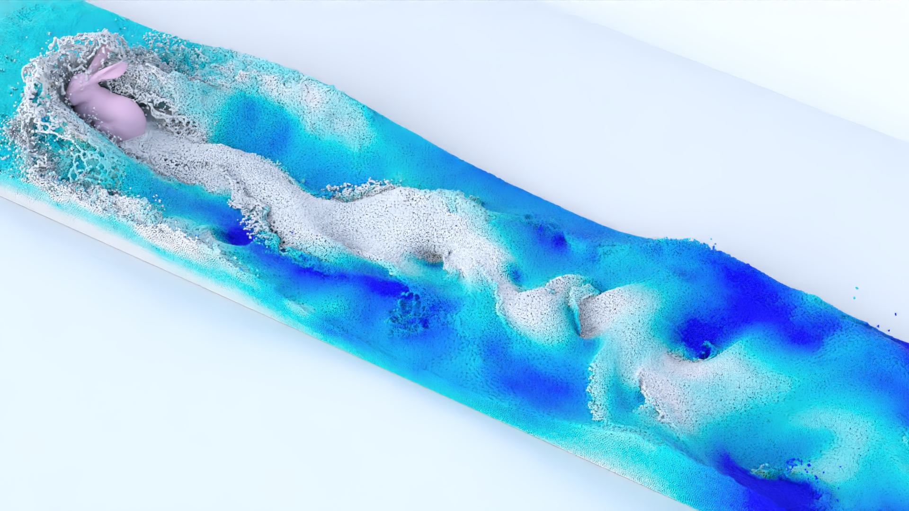

# Dynamic Importance Monte Carlo SPH Vortical Flows with Lagrangian Samples



## Abstract
We present a Lagrangian dynamic importance Monte Carlo method without non-trivial random walks for solving the Velocity-Vorticity Poisson Equation (VVPE) in Smoothed Particle Hydrodynamics (SPH) for vortical flows. Key to our approach is the use of the Kinematic Vorticity Number (KVN) to detect vortex cores and to compute the \emph{KVN-based importance} of each particle when solving the VVPE. We use Adaptive Kernel Density Estimation (AKDE) to extract a probability density distribution from the KVN for the the Monte Carlo calculations. Even though the distribution of the KVN can be non-trivial, AKDE yields a smooth and normalized result which we \emph{dynamically update} at each time step. As we sample actual particles directly, the Lagrangian attributes of particle samples ensure that the continuously evolved KVN-based importance, modeled by the probability density distribution extracted from the KVN by AKDE, can be closely followed. Our approach enables effective vortical flow simulations with significantly reduced computational overhead and comparable quality to the classic Biot-Savart law that in contrast requires expensive global particle querying.

## Installation and Run
Use Python's package installer pip to install Taichi Lang:
```
pip install taichi
```

To run this code:

```
python run_simulation.py --scene_file ./data/scenes/von_karman_vortex_street.json
```


## BibTex
If your feel this code helpful, please cite our paper :)
```
@ARTICLE{Ye2025Dynamic,
author={Ye, Xingyu and Wang, Xiaokun and Xu, Yanrui and Telea, Alexandru C. and Kosinka, Jiří and You, Lihua and Zhang, Jian Jun and Chang, Jian},
journal={IEEE Transactions on Visualization and Computer Graphics}, 
title={Dynamic Importance Monte Carlo SPH Vortical Flows With Lagrangian Samples}, 
year={2025},
volume={},
number={},
pages={1-15},
doi={10.1109/TVCG.2025.3612190}}
```
## Acknowledgement
Implementation of this paper is largely inspired by [SPH_Taichi](https://github.com/erizmr/SPH_Taichi).